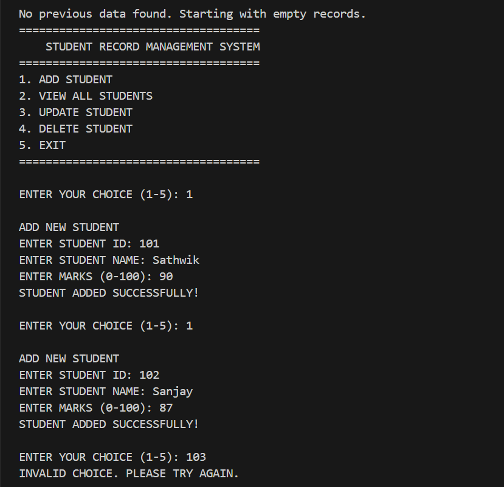
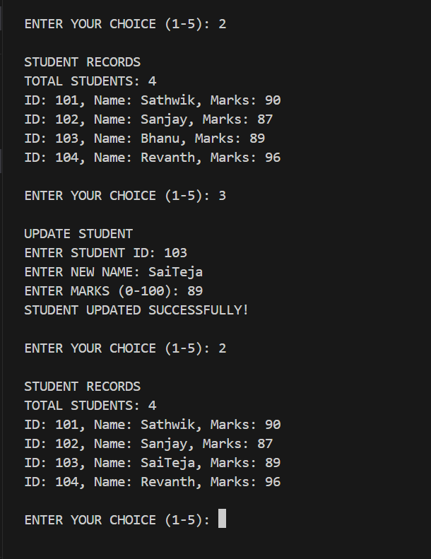
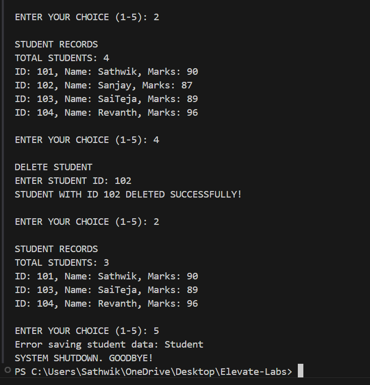
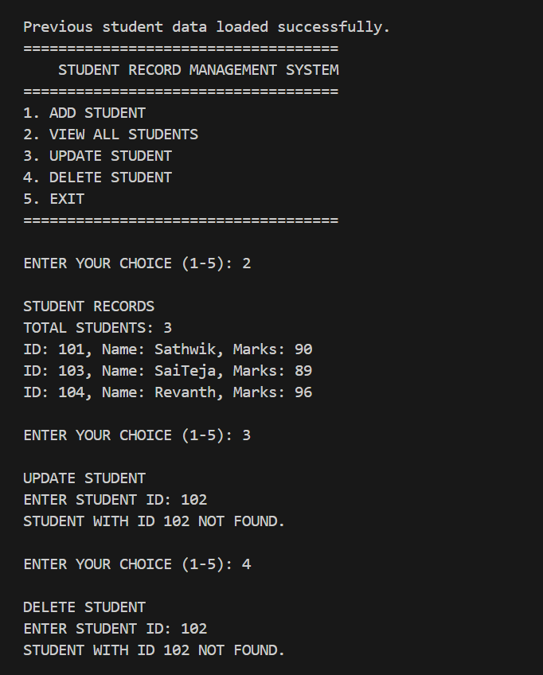
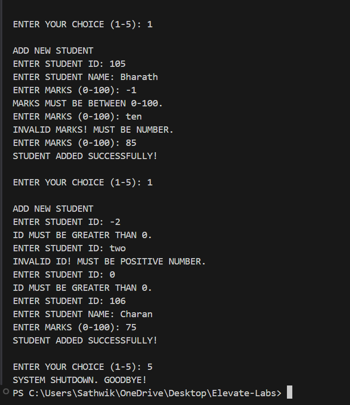
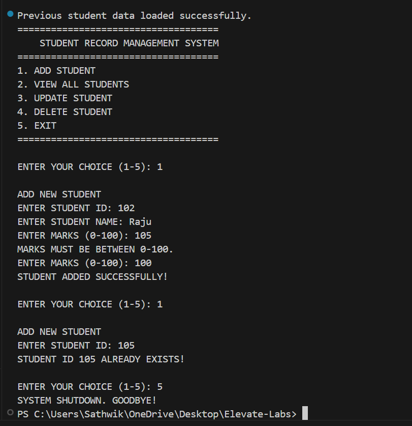

# 🎓 Java Student Record System

A robust command-line student management application built with Java featuring CRUD operations, data persistence, and comprehensive input validation.

## ✨ Features

### 📝 Core Operations
- **Add Students**: `ID, Name, Marks` with validation
- **View All**: Tabular display of all records
- **Update Entries**: Modify names/marks by ID
- **Delete Records**: Remove students by ID

### 🛡️ Validation System
- **ID Checks**: Positive integers, no duplicates, no characters
- **Mark Validation**: 0-100 range enforced
- **Name Rules**: Non-empty strings
- **Error Recovery**: Re-prompt on invalid input

### 💾 Data Persistence
- Automatic save/load to `students.dat`
- Handles file corruption gracefully
- Preserves data between sessions

  ## 🏗️ Code Architecture
Student-Record-Management-System/
│
├── src/
│ ├── Student.java # Student entity class
│ └── StudentManagementSystem.java # Main application class
│
├── students.dat # Auto-generated data file

## 🖥️ Demonstration

## 🖼️ Screenshot Gallery

### 1. System Initialization
  
*The system starts fresh when no previous data is found, showing the main menu and successfully adding first student records.*

### 2. Comprehensive Record View
  
*Displays all student records in a clean format, showing successful update operations (e.g., changing "Bhanu" to "SaiTeja").*

### 3. Record Deletion
  
*Demonstrates successful deletion of student #102 ("Sanjay") and the updated record count.*

### 4. Update Validation
  
*Shows proper handling of update attempts for non-existent students (ID 102 not found).*

### 5. Input Validation
  
*Highlights robust validation for:*
- Invalid marks (negative/over 100)
- Non-numeric input ("ten")
- Invalid student IDs (negative/zero)

### 6. Data Persistence
  
*Demonstrates:*
- Loading previous session data
- Duplicate ID prevention
- Graceful system shutdown

## Getting Started

# Compile the program
javac Calculator.java

# Run the calculator
java Calculator

## 💻 Usage Example
Enter choice (1-5): 1
Enter Student ID: 101
Enter Name: John Doe
Enter Marks (0-100): 85
Student added successfully!

## License

This project is licensed under the [MIT License](LICENSE) - see the LICENSE file for details.

## 📖 Project Description

**A robust Java console application** 
Designed to manage student records efficiently through a command-line interface. This system provides educational institutions with a simple yet powerful tool to maintain student data with full CRUD (Create, Read, Update, Delete) functionality.

